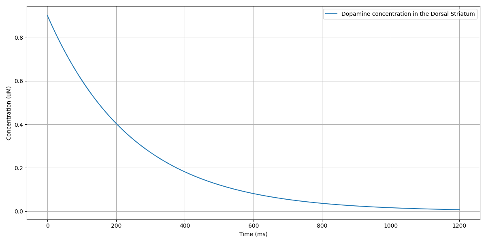

# NEURONExperiments

### This project implements a basic Spiking Neural Network that models Glutamatergic and Dopaminergic input from the cortex and Substantia Nigra respectively to innervate Medium Spiny Neurons in the Dorsal Striatum. The result is a modulatory effect of dopamine concentration in the Striatum.

### The goal of these experiments is to simulate the dynamics of the Basal Ganglia and its dysfunction in the context of Parkinson's Disease.

#### utils.py contains helper methods and classes interpolated from Yale's NEURON Python library https://nrn.readthedocs.io/en/8.0.1/python/programming/neuronpython.html 

### Requirements to run neuron_msn_network.py
#### Python 3.7 
#### NEURON 8.2.6